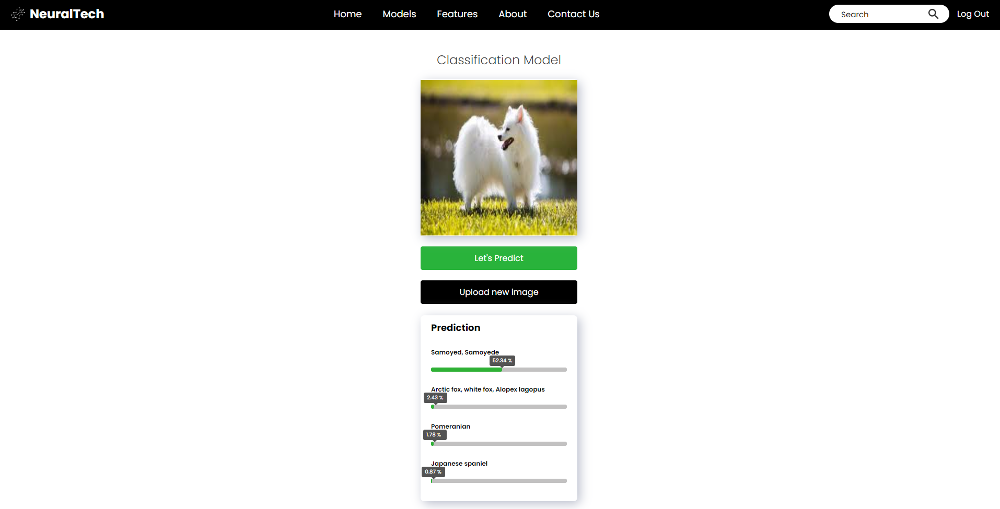

# NeuralTech (AI Model Web Application)

Welcome to the AI Model Web Application! This project provides a platform where users can try out various types of AI models through a web interface. The application is designed to be user-friendly and accessible, making it easy for anyone to experiment with different AI technologies.

## Features

- **Multiple AI Models**: Access a variety of AI models, including image recognition, natural language processing, and more.
- **User-Friendly Interface**: An intuitive web interface that allows users to interact with the AI models effortlessly.
- **Real-Time Results**: Get instant feedback and results from the AI models.

## Demo




## Getting Started

### Prerequisites

- [Node.js](https://nodejs.org/)
- [Python 3](https://www.python.org/)
- [Git](https://git-scm.com/)

### Installation

1. Clone the repository:
  ```bash
   git clone https://github.com/Robininyourarea/neuraltech-project.git
   cd your-repo-name
   ```

2. Set up the AI Server:
  ```bash
  cd .\AI-server\ 
  cd .\venv\
  cd .\Scripts\
  .\activate
  cd ..
  cd ..
  pip install -r requirements.txt
  pip3 install torch torchvision --index-url https://download.pytorch.org/whl/cu121
  python aiservermaster.py
  ```

3. Set up the Web Server:
  ```bash
  cd ./client
  npm install
  npm run dev
  ```

4. Set up the frontend (client):
  ```bash
  cd .\web-server\
  npm install
  npm run dev
  ```

5. Access the application at http://localhost:5173.

### Usage
Select an AI Model: Choose from a list of available AI models on the homepage.
Input Data: Provide the necessary input data for the selected model.
Run the Model: Click the "Run" button to execute the model.
View Results: The results will be displayed in real-time on the screen.
Contributing
We welcome contributions from the community! To contribute:

### Acknowledgements
- PyTorch
- React
